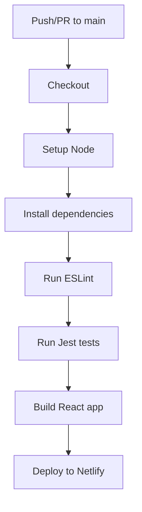

# Principal Backend Developer Mission Report

**Agent**: principal-backend  
**Generated**: 2026-07-23T09:30:49.446Z

---

## Branch: feature/task-016-setup-ci

## Files Changed

- **created** `.github/workflows/ci.yml` — Add CI workflow to lint, test, build, and deploy to Netlify

## Notes

Created a GitHub Actions workflow that triggers on pushes and PRs to main, runs ESLint, Jest tests, builds the React app, and deploys the build folder to Netlify using the Netlify Action. Assumes npm scripts: lint, test, build exist and Netlify secrets are configured.

## Diagram


# Principal Backend Developer Mission Report

**Agent**: principal-backend  
**Generated**: 2026-07-23T09:40:42.730Z

---

## Branch: feature/task-017-netlify-config

## Files Changed

- **created** `netlify.toml` — Add Netlify configuration with build command and publish directory

## Notes

Created netlify.toml as required. Netlify token configuration is a CI secret and cannot be set via repository files; ensure the token is added to GitHub repository secrets named NETLIFY_AUTH_TOKEN.

# Principal Backend Developer Mission Report

**Agent**: principal-backend  
**Generated**: 2026-07-23T09:53:36.741Z

---

## Branch: feature/task-018-sentry-integration

## Files Changed

- **created** `package.json` — Added project metadata and dependencies including @sentry/react and @sentry/tracing
- **created** `tsconfig.json` — Configured TypeScript compiler options for React JSX and strict type checking
- **created** `src/sentry.ts` — Initialized Sentry with BrowserTracing integration, using environment variables for DSN and environment
- **created** `src/App.tsx` — Simple placeholder React component for the calculator UI
- **created** `src/index.tsx` — Entry point that imports Sentry initialization and renders the App component

## Notes

Sentry integration assumes REACT_APP_SENTRY_DSN environment variable is set in the production build. No additional runtime configuration is required. The placeholder App component can be replaced with the full calculator UI later. All files compile with the provided tsconfig and dependencies.

## Diagram

```mermaid
flowchart TD
    index[src/index.tsx] -->|import| sentry[src/sentry.ts]
    sentry -->|init Sentry| SentryService[@sentry/react]
    index -->|render| App[src/App.tsx]
    App -->|UI| Browser
```
