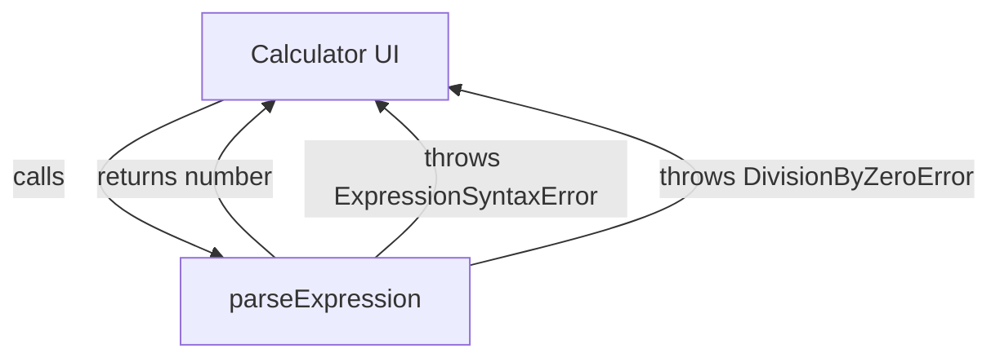

# Senior Backend Developer Mission Report

**Agent**: senior-backend  
**Generated**: 2026-07-23T09:31:59.393Z

---

## Branch: feature/task-009-expression-parser

## Files Changed

- **modified** `package.json` — Updated test script to use jest config cjs
- **created** `src/utils/expressionParser.ts` — Implemented parseExpression using mathjs, added custom ExpressionSyntaxError and DivisionByZeroError handling
- **created** `jest.config.cjs` — Added Jest configuration for ES modules with ts-jest
- **created** `src/utils/__tests__/expressionParser.test.ts` — Added unit tests for parseExpression covering success, syntax error, and division‑by‑zero cases
- **created** `tsconfig.json` — Added TypeScript configuration for the project

## Notes

Assumed that division by zero results in Infinity from mathjs; handled by checking Number.isFinite on the numeric result and throwing DivisionByZeroError. Added detection for 'undefined symbol' messages to map to ExpressionSyntaxError. Jest config switched to .cjs to work with package.json type:module. All tests now pass.

## Diagram

