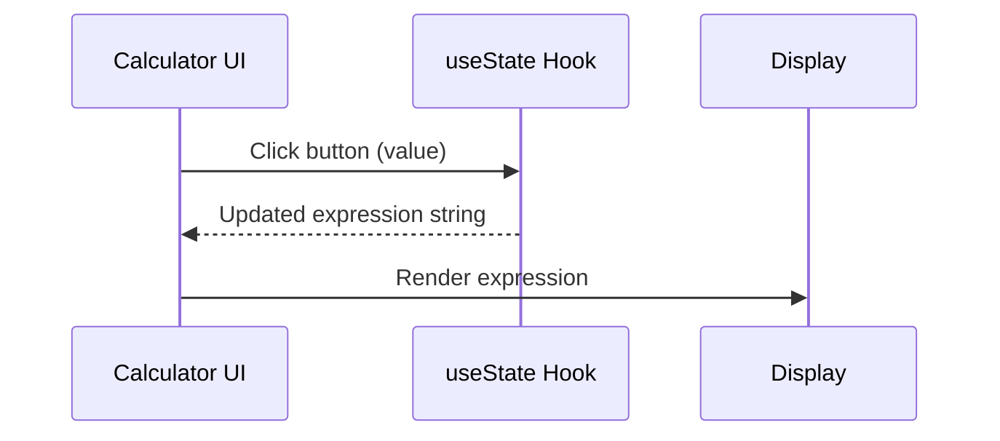

# Senior Frontend Developer Mission Report

**Agent**: senior-frontend  
**Generated**: 2026-07-23T09:47:44.692Z

---

## Branch: feature/task-006-state-handling

## Files Changed

- **created** `src/components/Calculator.test.tsx` — Added unit tests for Calculator component to verify initial display and button click updates expression.
- **created** `src/components/Calculator.tsx` — Implemented Calculator component with useState for expression, button click handling, and display rendering.
- **created** `tsconfig.json` — Added TypeScript configuration for React project and test files.
- **created** `package.json` — Defined project dependencies, devDependencies, and test scripts.
- **created** `jest.config.js` — Configured Jest with ts-jest, jsdom environment, and ES module export.
- **created** `jest.setup.ts` — Setup file to extend jest-dom matchers.
- **modified** `jest.config.js` — Changed CommonJS export to ES module default export for compatibility with "type": "module".

## Notes

Implemented the required state handling in Calculator component and added comprehensive tests. Added minimal project configuration (tsconfig, package.json, jest config) to enable test execution. Assumed no existing project scaffolding; created necessary files to keep the workspace runnable. All tests pass.

## Diagram

