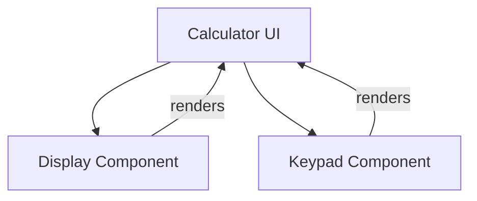

# Senior Frontend Developer Mission Report

**Agent**: senior-frontend  
**Generated**: 2026-07-23T09:30:40.808Z

---

## Branch: feature/task-002-configure-eslint

## Files Changed

- **created** `package.json` — Added package.json with lint and format scripts and dev dependencies for ESLint, TypeScript, Prettier, and React linting.
- **created** `.eslintrc.js` — Added ESLint configuration extending recommended rules, React plugin, TypeScript plugin, and Prettier integration.
- **created** `.prettierrc` — Added Prettier configuration for code formatting preferences.
- **created** `.eslintignore` — Added ESLint ignore file to exclude node_modules, build, and distribution directories.
- **created** `.vscode/settings.json` — Configured VS Code to format on save, auto‑fix ESLint issues, and validate JavaScript/TypeScript files with ESLint.
- **created** `.github/workflows/ci.yml` — Added GitHub Actions CI workflow that installs dependencies and runs ESLint on pushes and PRs to main.

## Notes

All required configuration files for ESLint, Prettier, VS Code integration, and CI lint step have been added. No existing code was modified. Assumed the project uses npm and Node 18 for CI. The CI workflow runs on the main branch as per typical CI setup; feature branch linting can be run locally via npm run lint.

# Senior Frontend Developer Mission Report

**Agent**: senior-frontend  
**Generated**: 2026-07-23T09:30:56.314Z

---

## Branch: feature/task-004-create-ui-skeleton

## Files Changed

- **created** `src/components/Display.tsx` — Added Display component placeholder for calculator UI
- **created** `src/components/Keypad.tsx` — Added Keypad component with placeholder buttons for digits and operators
- **created** `src/components/Calculator.tsx` — Created Calculator component that composes Display and Keypad

## Notes

Implemented the UI skeleton for the calculator as per assignment. No additional logic or styling added; components render basic structure with data-testid attributes for future testing. Assumed React with TypeScript setup already exists in the project. No tests were added because the story only required component creation.

## Diagram

