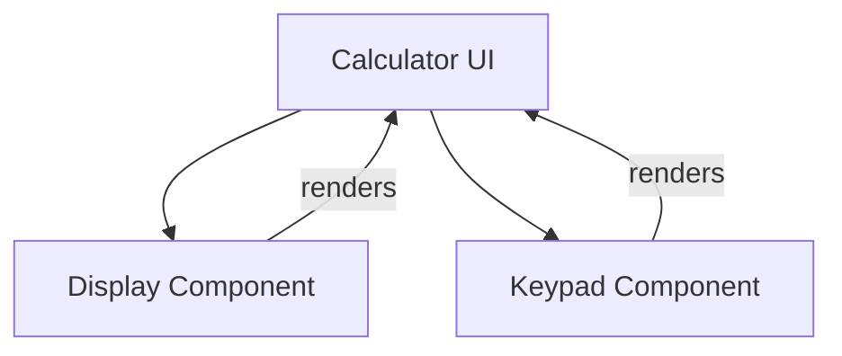

# Senior Frontend Developer Mission Report

**Agent**: senior-frontend  
**Generated**: 2026-07-23T09:30:56.314Z

---

## Branch: feature/task-004-create-ui-skeleton

## Files Changed

- **created** `src/components/Display.tsx` — Added Display component placeholder for calculator UI
- **created** `src/components/Keypad.tsx` — Added Keypad component with placeholder buttons for digits and operators
- **created** `src/components/Calculator.tsx` — Created Calculator component that composes Display and Keypad

## Notes

Implemented the UI skeleton for the calculator as per assignment. No additional logic or styling added; components render basic structure with data-testid attributes for future testing. Assumed React with TypeScript setup already exists in the project. No tests were added because the story only required component creation.

## Diagram

