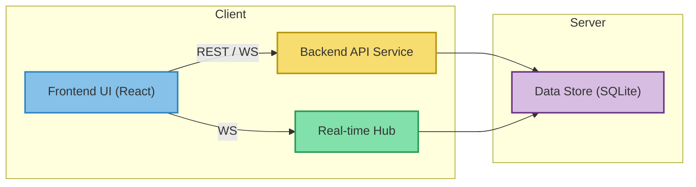

# Architect Mission Report

**Agent**: architect  
**Generated**: 2026-08-13T02:21:00.012Z

---

## Architecture Style

client-server

## Components

- **Frontend UI** (ui): React single‑page application that renders the retro board, handles user interactions, and communicates with the backend via REST and WebSocket.
- **Backend API Service** (service): Express.js server exposing REST endpoints for session creation, CRUD of columns, cards, clusters and action items.
- **Real-time Hub** (service): Socket.io based WebSocket server that broadcasts session changes (cards, votes, actions) to all connected participants and handles reconnection logic.
- **Data Store** (database): SQLite file storing session state (sessions, columns, cards, clusters, votes, action items) persistently.
- **Shared Types** (library): TypeScript interfaces shared between frontend and backend to guarantee contract stability.
- **Infrastructure** (infra): Docker containers for frontend and backend, orchestrated with Docker Compose for local development and simple production deployment.

## Tech Stack

- **frontend**: React 18 with Vite — React’s component model and huge ecosystem make rapid UI development easy; Vite provides instant dev server start‑up and fast builds. Vue would be similar but the team’s existing expertise is in React; Angular adds unnecessary ceremony for a small SPA.
- **backend**: Node.js 20 with Express.js — Using the same language (JavaScript/TypeScript) across front‑ and back‑end reduces context switching and allows sharing types. Express is battle‑tested, lightweight, and integrates seamlessly with Socket.io. Go offers higher performance but adds a new language; FastAPI is great but would split the stack.
- **real-time**: Socket.io — Socket.io abstracts fallback transports, provides rooms (per session), and simple emit/listen API, which accelerates development. The bare ws library requires manual reconnection handling; SSE is uni‑directional and unsuitable for drag‑and‑drop updates.
- **database**: SQLite — SQLite is file‑based, requires zero operational overhead, and is sufficient for the low‑traffic, single‑session‑per‑instance usage expected in v1. PostgreSQL adds unnecessary complexity; MongoDB would be overkill for relational data like cards and votes.
- **infra**: Docker — Docker guarantees identical environments locally and in production, simplifies CI/CD, and isolates the two services. Bare‑metal would make onboarding harder; a non‑containerized frontend loses the parity benefit.
- **testing**: Jest — Jest works for both Node and browser code, has built‑in TypeScript support, and provides snapshot testing for React components. Mocha requires additional setup; Vitest is newer and less mature for the backend side.
- **ci/cd**: GitHub Actions — The repository lives on GitHub, so Actions offers native integration, free minutes for public repos, and straightforward YAML pipelines. GitLab CI would require moving the repo; CircleCI adds external service overhead.
- **auth**: None (random session IDs) — The spec explicitly states no login is required for the first version; random, hard‑to‑guess IDs provide sufficient isolation without added complexity.

## Epics

- **EPIC-001** Session Management: Facilitator can create a new retro session, obtain a shareable link, and participants can join via that link. Session IDs are random and stored persistently.
- **EPIC-002** Columns & Cards: Default columns are provisioned; participants can add, edit, delete cards with optional author info. Facilitator can rename/add/remove columns.
- **EPIC-003** Real‑Time Collaboration: All changes (cards, moves, votes, actions) are broadcast instantly to every connected participant via WebSocket. Includes reconnection and offline fallback.
- **EPIC-004** Grouping & Voting: Participants can drag cards into clusters, assign a configurable number of votes, and view vote counts per card/cluster.
- **EPIC-005** Action Items: Facilitator can turn any card or cluster into an action item with title, description, owner, and optional due date. Action items are listed, editable, and can be marked done.
- **EPIC-006** Offline Resilience: If the WebSocket connection drops, the app continues to work locally and synchronizes all pending changes once connectivity is restored.

## Architecture Diagram

