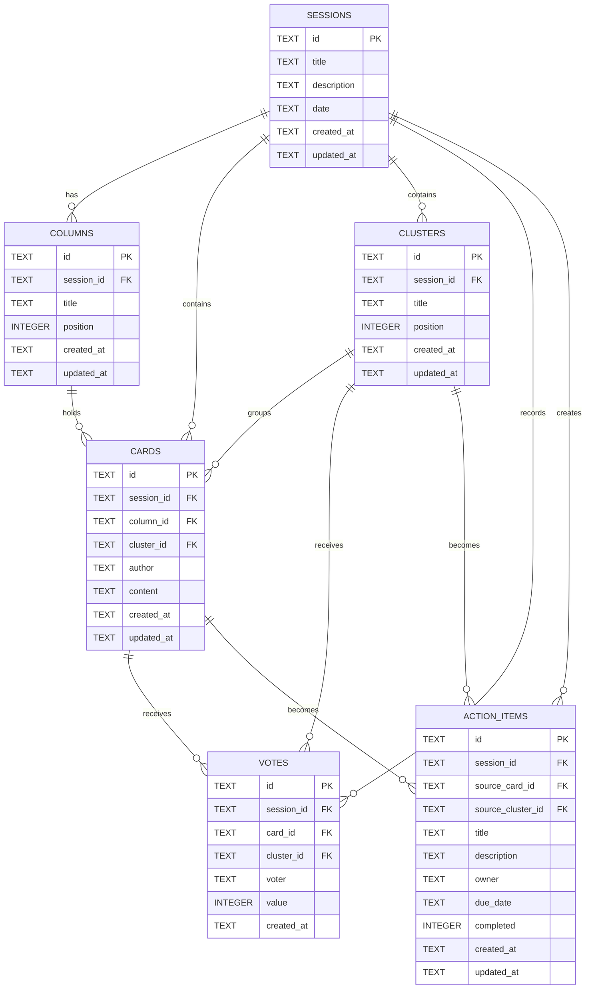

# DBA Mission Report

**Agent**: dba  
**Generated**: 2026-08-13T02:22:30.320Z

---

## Database Engine: SQLite

SQLite is a zero‑configuration, file‑based relational engine that matches the project's requirement for a lightweight, single‑instance persistence layer. It integrates seamlessly with Node.js via the `sqlite3` or `better-sqlite3` packages, supports full SQL (including foreign keys and indexes), and is sufficient for the low‑traffic, session‑oriented usage pattern of the retro board application while keeping the Docker image small.

## Entities (6)

- **sessions**: 6 columns
- **columns**: 6 columns
- **cards**: 8 columns
- **clusters**: 6 columns
- **votes**: 7 columns
- **action_items**: 11 columns

## ERD

