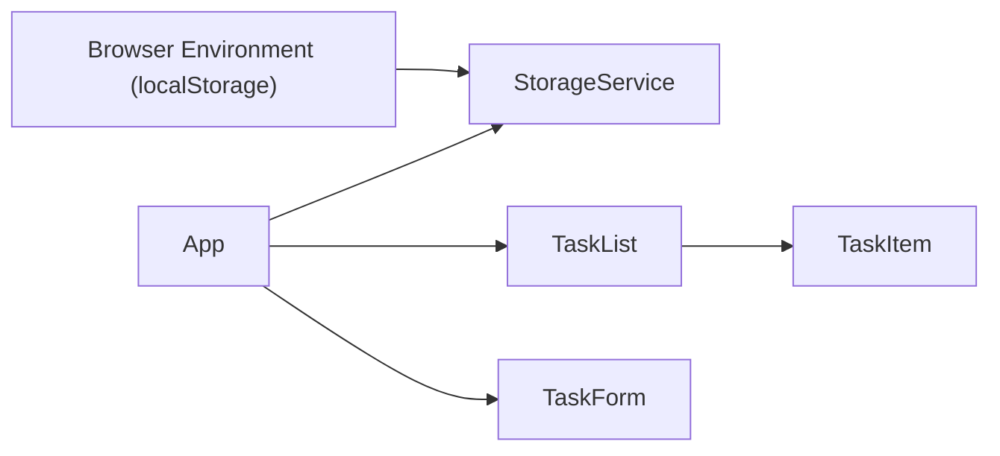

# Architect Mission Report

**Agent**: architect  
**Generated**: 2026-08-13T02:36:01.872Z

---

## Architecture Style

client-serverless (SPA)

## Components

- **App** (ui): Root React component that orchestrates task CRUD and persistence.
- **TaskList** (ui): Displays the list of tasks, delegating each row to TaskItem.
- **TaskItem** (ui): Renders a single task with toggle, edit and delete actions.
- **TaskForm** (ui): Form for creating a new task or editing an existing one.
- **StorageService** (service): Thin wrapper around browser localStorage for loading and saving the task array.
- **BrowserEnvironment** (environment): The user's browser providing the DOM and localStorage.
- **StaticHost** (infra): Static file host (e.g., GitHub Pages) serving the built SPA.

## Tech Stack

- **frontend**: React 18 with TypeScript (Vite build) — React offers a mature component model, excellent TypeScript support, and a huge ecosystem of UI libraries. Vue is comparable but the team’s existing expertise is in React, reducing ramp‑up time. Svelte compiles away the framework but has a smaller ecosystem and less familiarity for most web engineers, increasing risk for a simple SPA.
- **buildTool**: Vite — Vite provides lightning‑fast dev server start‑up and native ES module handling, resulting in a smaller config footprint. CRA abstracts configuration but is heavier and slower. Webpack is powerful but overkill for a small SPA and requires more boilerplate.
- **testing**: Vitest + @testing-library/react — Vitest integrates tightly with Vite, runs in the same environment, and has near‑zero config. Jest is solid but adds extra setup and slower cold starts. Cypress is great for end‑to‑end tests but unnecessary for unit/component coverage in a tiny app.
- **ci/cd**: GitHub Actions deploying to GitHub Pages — GitHub Actions is native to the repository host, requires no external service, and can directly push the built `dist/` folder to GitHub Pages. GitLab CI would need a GitLab host, and CircleCI adds external complexity for a simple static site.
- **infra**: Static hosting on GitHub Pages — GitHub Pages is free, zero‑config for static assets, and integrates with the chosen CI pipeline. Netlify/Vercel provide extra features (functions, edge caching) that are unnecessary for a local‑storage‑only SPA.

## Epics

- **EPIC-001** Task CRUD UI: Implement create, edit, delete, and toggle‑done functionality with a responsive list view.
- **EPIC-002** Local Persistence: Persist the task array in browser localStorage so data survives page reloads.
- **EPIC-003** Responsive & Accessible Design: Make the UI work on mobile and desktop, with proper ARIA attributes and keyboard support.

## Architecture Diagram

