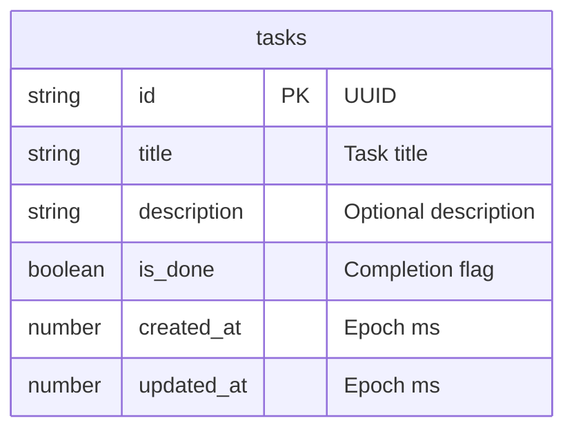

# DBA Mission Report

**Agent**: dba  
**Generated**: 2026-08-13T02:37:55.639Z

---

## Database Engine: IndexedDB (via Dexie.js)

The application is a pure client‑side SPA with no backend server. IndexedDB is the native browser storage engine that supports structured data, indexes, and versioned migrations. Dexie.js provides a thin, promise‑based wrapper that integrates cleanly with TypeScript/React, matching the existing tech stack (React 18, TypeScript, Vite) without adding external services.

## Entities (1)

- **tasks**: 6 columns

## ERD

